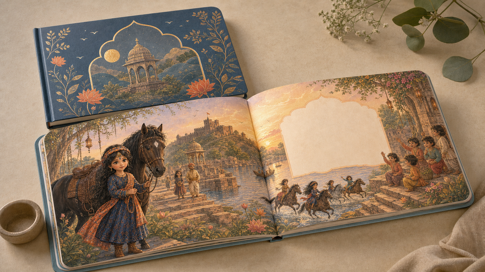

# Maitri Landscape Storybook Production Brief

> **Decision:** develop the first purchase-ready Maitri character book as a 297 x 210 mm landscape picture book, using a continuous panoramic scene across each spread, a soft-touch matte cover with selective gloss accents, and a 32-page saddle-stitched pilot before committing to a collector hardcover edition.

## Purpose and scope

This brief turns the Maitri character-story concept into a repeatable physical product system. It covers the format, art-direction rules, print files, sampling process, online-sales implications, Bengaluru production shortlist, and a quote-ready specification. It is designed for Shwetika's review and for use with a selected printer.

The proposed landscape book is a new product family. It preserves Maitri's existing child-first, Manu-led story approach while changing the physical form from the earlier square launch default to a wider cinematic format.

## Executive recommendation

Use **A4 landscape trim, 297 x 210 mm**, for the local-print edition. It creates a generous 594 x 210 mm open spread without asking a printer to make an unusual format. Start with **32 interior pages plus 4 cover pages**, fully illustrated in colour, and bind it with **saddle stitching**. This is economical, opens well for continuous scenes and is appropriate for a first run.

Use a **300 to 350 gsm cover board**, finished in **soft-touch matte lamination**, with selective **spot UV** on a small number of character, moon, horse or title motifs. Use **150 to 170 gsm matte or silk art paper** inside. This achieves the requested matte-gloss contrast while keeping the reading pages low-glare and tactile.

For a premium collector edition, request a separately priced **casebound hardcover** option. Do not begin there until samples, customer response and target selling price have been tested.

## Product format and standards

| Area | Launch standard | Rationale |
| --- | --- | --- |
| Finished trim | 297 x 210 mm, landscape | Familiar sheet size, wide cinematic spread, straightforward local quoting |
| Extent | 32 interior pages + 4 cover pages | Multiple of four; enough space for a complete picture-book arc |
| Binding | Saddle stitched | Opens flatter than a glued spine at this page count; cost-effective for pilot runs |
| Premium option | Casebound hardcover | Durable gift or collector edition after launch validation |
| Cover | 300 to 350 gsm art board | Resists handling and supports lamination |
| Interior | 150 to 170 gsm matte or silk art paper | Rich colour without glare; stronger than standard book paper |
| Finish | Soft-touch matte cover; selective spot UV | Premium tactile contrast without making every surface glossy |
| Print | Full-colour CMYK | Commercial-print standard for controlled colour output |
| Corners | Rounded | Friendly handling and lower corner damage risk |

## Story and visual architecture

Each title should carry one character, one defining childhood adventure, one central value, one emotional challenge and one satisfying resolution. The book should close with a direct letter to the child. Activities and stickers should remain separate inserts in the box or package because their stock, adhesive and die-cut process differ from book production.

### Continuous-spread rule

Every open spread is one uninterrupted environment. The left and right pages must feel like one scene, while still giving each side a distinct storytelling role:

- **Left page:** the large emotional or action moment, usually the character and the central visual beat.
- **Right page:** a calm reading area integrated into the same scenery, with short text and secondary visual details.
- **Across the gutter:** only forgiving background elements such as sky, water, paths, foliage or architecture. Never place a face, hand, important prop or text in the centre fold.
- **Reading density:** plan around 40 to 90 words per spread, in generous type with strong contrast.

For the Manu title, use the existing blue and rust-orange costume language, dark horse, river ghats, stone steps, fort-world and warm historical Indian setting. Keep the imagery story-first and child-centred rather than treating the book as a historical textbook.

## Print-ready artwork handoff

| Item | Requirement |
| --- | --- |
| Page file | 303 x 216 mm per page: 297 x 210 mm trim plus 3 mm bleed on all sides |
| Image resolution | 300 ppi at final placed size |
| Safe area | Keep critical text and faces 12 to 15 mm from trim and gutter |
| Colour | CMYK, using the selected printer's ICC profile when supplied |
| Export | Print-ready PDF/X-4; fonts embedded; no editable links or missing assets |
| Cover | Separate flat cover-wrap PDF built from the printer's final spine template |
| Delivery | Single-page interior PDF, separate cover PDF, and low-resolution spread-preview PDF for creative approval |

Do not submit a single giant spread PDF unless the printer requests it. Printers typically impose single pages; the spread-preview document exists to protect the intended visual continuity.

## Sample book concept

*Concept direction only. The artwork demonstrates the intended landscape product format, Manu-led visual world, continuous spread scenery, calm text area and matte-premium physical treatment. Final artwork must be created and licensed for production.*

## Implementation plan

### Phase 1 - Design system and story package

1. Confirm the age band, intended retail price and whether the first book sells independently or inside the doll box.
2. Lock the 32-page pagination map, writing range and the character's emotional arc.
3. Create a reusable landscape master template with page, bleed, safe-zone, gutter and text-style layers.
4. Build an illustration brief for every spread. Mark which background elements cross the gutter and where the text lives.
5. Produce the cover artwork, barcode area and back-cover product copy after the retail channel is chosen.

### Phase 2 - Production proofing

1. Send the exact same RFQ and sample files to at least three shortlisted printers.
2. Review a white dummy for page turn, gutter behaviour, size and weight.
3. Review a colour proof under daylight and warm indoor light for skin tone, blue/rust costume colours and dark shadow detail.
4. Produce a 10 to 25 copy pilot run.
5. Test child handling, readable type, page durability, colour consistency, parent perception and packaging fit before releasing a larger order.

### Phase 3 - Repeatable character series

1. Freeze the physical spec, art template and printer preflight checklist after the Manu pilot passes.
2. Reuse the same format for each character while changing the setting, central value and emotional problem.
3. Keep stickers as separate die-cut inserts and use the same box-insert dimensions across titles.
4. Track production version, colour proof approval and replenishment date for every title.

## Sales and distribution choice

For direct Indian sales, use the wide A4 landscape master edition and hold inventory through a local printer plus the Maitri site, Shopify or a marketplace seller workflow.

Amazon KDP is not a clean fit for this exact master edition. KDP paperback custom trim width is currently limited to 8.5 inches (215.9 mm), below a 297 mm landscape width; KDP also states that Amazon India does not support paperback or hardcover distribution. If Amazon print-on-demand becomes essential, make a separate narrower edition instead of compromising the local master format. See [KDP print options](https://kdp.amazon.com/en_US/help/topic/G201834180) and [KDP paperback printing cost and marketplace availability](https://kdp.amazon.com/en_US/help/topic/G201834340?tstart=0).

## Bengaluru printing-studio shortlist

This is a capability-based shortlist, not a quality ranking. Before selecting a supplier, verify the exact trim, paper mill, lamination, spot UV, binding method, lead time, proof process and delivered unit price in writing.

| Studio | Relevant published capability | Best fit for this brief |
| --- | --- | --- |
| [Lavanya Mudrana](https://thelavanya.com/) | Bangalore book manufacturer; children’s books; saddle stitch, perfect binding, case binding, UV coating, embossing, foiling and rounded corners | First choice for scalable premium series and complex finishing |
| [Matha Printers and Publishers](https://www.mathapress.com/print.php) | Hardback/case binding, saddle stitch and book-layout support | Book-focused local option for an author-led project |
| [Best Printers](https://bestprinters.co.in/services/books-printing/) | Custom dimensions, short and bulk runs, saddle stitch, hardbound, matte/gloss options | Flexible quotation and initial sample comparison |
| [National Printing Press](https://www.nppblr.com/books) | Hardbound books and lower-page-count booklets; Koramangala location | Premium hardbound comparison and convenient local review |
| [Printigly](https://www.printigly.in/custom-printed-booklets/) | Landscape orientation, custom sizes, full-colour CMYK, saddle stitch, matte/gloss/soft-touch cover options | Short-run prototypes and fast pilot quantities |
| [Dahlia Imprints](https://dahliaimprints.com/books-printing-in-bangalore/) | Custom sizes, digital and offset, matte/gloss/textured stock, hardbound and saddle stitch options | Additional competitive quote for small to medium runs |
| [Swathi Binding Works](https://swathibinding.com/) | Digital and offset production with custom hardcover and softcover binding | Small-run binding and local production comparison |
| [Rohan Graphics](https://www.rohangraphics.in/) | Book printing and hardcover-book service in Whitefield/Varthur | East Bengaluru option; confirm landscape trim and finish capability |

## Quote-ready request to send printers

> Please quote for a full-colour children’s picture book at 297 x 210 mm landscape, 32 interior pages plus 4 cover pages. Interior: 150 to 170 gsm matte or silk art paper. Cover: 300 to 350 gsm art board with soft-touch matte lamination and selective spot UV. Binding: saddle stitch, rounded corners. Please quote 25, 100 and 500 copies, separately state proof cost, turnaround, colour-control process, delivery, tax and a premium casebound-hardcover alternative. We will supply a CMYK PDF/X-4 with 3 mm bleed and require a physical colour proof before final production.

## Preflight and selection checklist

- Confirm that the printer accepts custom 297 x 210 mm landscape trim without an excessive setup premium.
- Ask for physical samples of matte interior stock, soft-touch laminate and spot UV together.
- Confirm whether the first spread and last spread have any binding or opening restriction.
- Inspect the printer proof for muddy shadows, excessive saturation, weak skin tones and loss of detail in dark hair or horse imagery.
- Confirm a single accountable contact, proof-approval process, replacement policy and delivery date.
- Obtain a final cover-spine template only after the printer, page count, stock and binding are locked.

## Source notes

The specifications above combine established Maitri production direction with public printer and publishing-platform information reviewed on 15-16 July 2026. Printer capabilities are described from the studios’ own websites and must be reconfirmed at quotation stage.

- [Lavanya Mudrana - books, bindings and finishes](https://thelavanya.com/)
- [Matha Printers and Publishers - book printing](https://www.mathapress.com/print.php)
- [Best Printers - books printing](https://bestprinters.co.in/services/books-printing/)
- [National Printing Press - books and magazines](https://www.nppblr.com/books)
- [Printigly - custom printed booklets](https://www.printigly.in/custom-printed-booklets/)
- [Dahlia Imprints - custom books printing](https://dahliaimprints.com/books-printing-in-bangalore/)
- [Swathi Binding Works](https://swathibinding.com/)
- [Rohan Graphics](https://www.rohangraphics.in/)
- [Amazon KDP - Print Options](https://kdp.amazon.com/en_US/help/topic/G201834180)
- [Amazon KDP - Paperback Printing Cost](https://kdp.amazon.com/en_US/help/topic/G201834340?tstart=0)
